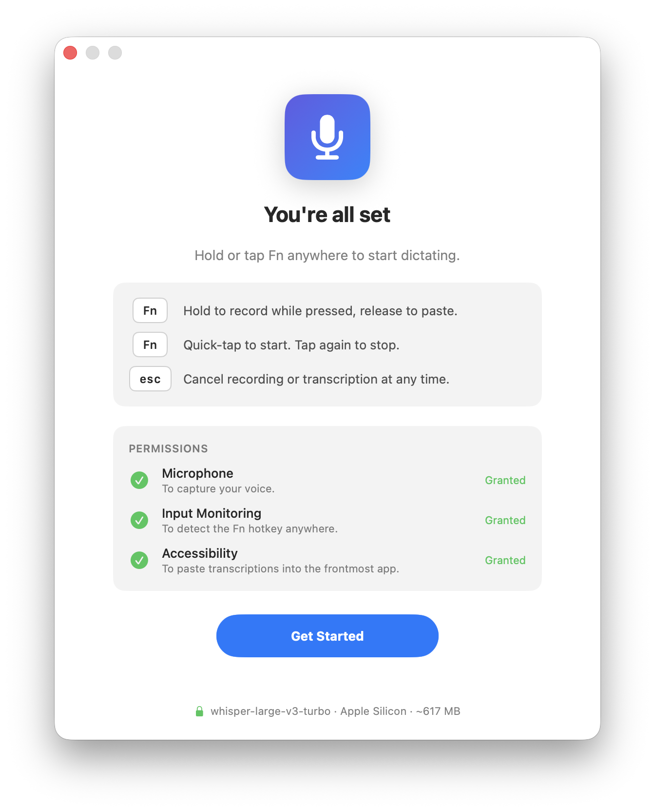
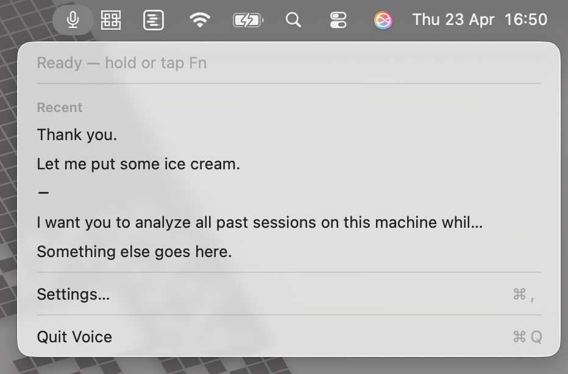
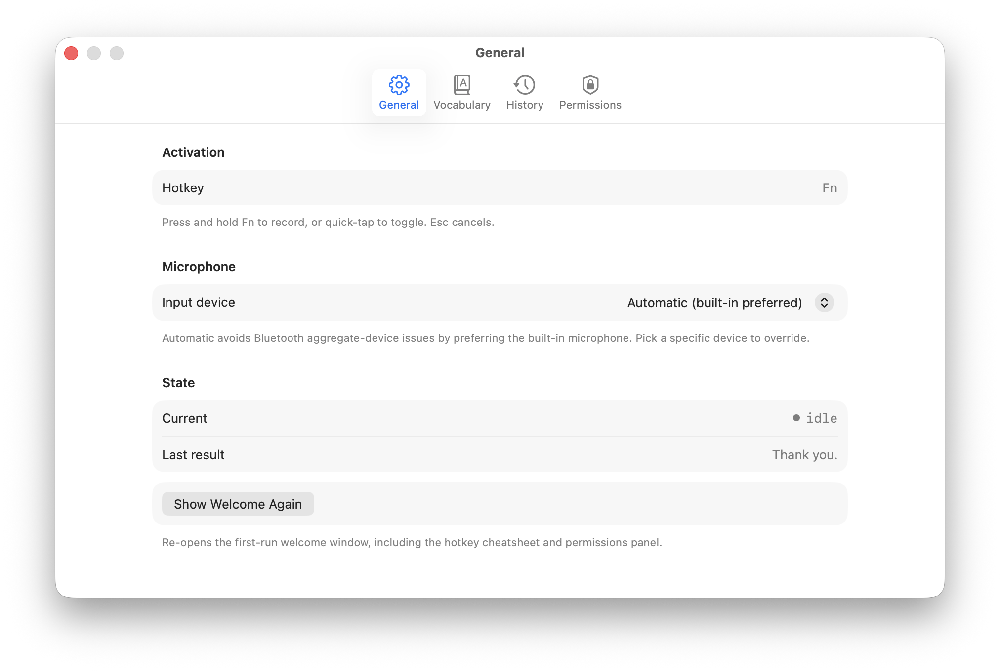
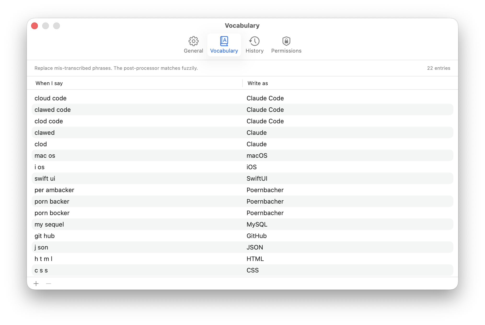

# Voice

Push-to-talk dictation for macOS that runs entirely on your Mac. Hold the **Fn**
key anywhere, speak, release — the text gets pasted into whatever app is in
front of you. No audio ever leaves the machine.

> ⚠️ **Early and unsigned.** Voice is a personal project kept in working shape,
> not a distributed app. You'll need Xcode to build and run it. Use it if you
> like poking at this kind of thing.

<!-- docs/screenshots/hero.png — welcome window after download, "You're all set" stage with permissions card visible -->
<p align="center"></p>

## What it does

- **Hold Fn** anywhere → record → release → clean transcription pasted where
  your cursor is. **Quick-tap Fn** to toggle recording on/off without holding.
  **Esc** cancels.
- Transcription is done locally with [WhisperKit][whisperkit]'s Core ML build
  of `large-v3-turbo` on the Neural Engine.
- Punctuation, capitalization, filler-word cleanup, and vocabulary
  substitution are done by Apple's on-device `FoundationModels` (Apple
  Intelligence). Fully offline on a supported Mac.
- Every transcription goes into a local SQLite history with full-text search.
  **Audio is never stored** — only the text, duration, language, and the
  app that received the paste.

<!-- docs/screenshots/pill.png — the floating recording pill over e.g. a text editor, showing mic tile + waveform + timer + esc-cancel hint -->
<p align="center"></p>

## Requirements

- macOS 26 (Tahoe) or later
- Apple Silicon (the Core ML model ships as an ANE build)
- ~1 GB free disk for the downloaded model
- Apple Intelligence enabled, if you want the on-device cleanup step. Without
  it the raw Whisper text is pasted — still usable, just rougher.

## Build & run

```bash
git clone <this repo>
cd voice
open Voice.xcodeproj
```

Select the **Voice** scheme and press ⌘R. First launch:

1. Asks for microphone permission.
2. Opens a welcome window that downloads the Whisper model (~617 MB).
3. Nudges you to grant **Input Monitoring** (for the global Fn hotkey) and
   **Accessibility** (to synthesize ⌘V into the frontmost app) in System
   Settings.
4. Re-launch after granting — macOS caches permission checks per process.

Once the model is cached under
`~/Library/Application Support/Voice/models/`, the welcome window never shows
again — unless you wipe that folder, in which case Voice re-onboards
automatically.

## Using it

The app lives in the menu bar. The icon tells you the current state:
`mic` (idle) → `mic.fill` (recording) → `waveform` (transcribing).

<!-- docs/screenshots/menubar.png — menu bar dropdown open, showing state, recent transcriptions, Settings link -->
<p align="center"></p>

Settings (⌘, from the menu) has four tabs:

- **General** — hotkey, mic picker (with automatic built-in preferred),
  current state, last result, and a re-show-welcome button.
- **Vocabulary** — replacement rules: "when I say X, write Y". The
  post-processor applies these fuzzily. Pre-seeded with a batch of
  common technical-term mishears.
- **History** — full list with full-text search; copy any entry back to
  the clipboard; clear all.
- **Permissions** — live status for Microphone, Input Monitoring, and
  Accessibility, with shortcuts to the right System Settings panes.

<!-- docs/screenshots/settings-general.png — Settings window General tab -->
<p align="center"></p>

<!-- docs/screenshots/settings-vocabulary.png — Settings Vocabulary tab with a few example rows visible -->
<p align="center"></p>

## Privacy

Everything is on-device. Concretely:

| What                    | Where                                                         |
|-------------------------|---------------------------------------------------------------|
| Audio                   | Never persisted. Buffers are discarded after transcription.   |
| Raw + cleaned text      | `~/Library/Application Support/Voice/history.sqlite`          |
| Vocabulary              | `~/Library/Application Support/Voice/vocabulary.json`         |
| Whisper model           | `~/Library/Application Support/Voice/models/` (~617 MB)       |
| UserDefaults            | Only the picked input-device UID, if any                      |

No network calls except the initial WhisperKit model download from Hugging
Face. Deleting the three paths above returns the app to first-launch state.

## Architecture in 30 seconds

Hub-and-spoke with `AppController` as the `@Observable @MainActor` hub.
Long-running I/O lives behind actors; UI observes state and triggers
transitions through controller methods.

| File                    | Role                                                          |
|-------------------------|---------------------------------------------------------------|
| `AppController`         | Central state machine; hotkey → recorder → transcribe → paste |
| `Hotkey`                | Global Fn/Esc detection via `CGEventTap`                      |
| `Recorder`              | `AVCaptureSession` pinned to the built-in mic                 |
| `Transcriber`           | WhisperKit actor with lazy load + task-cached reentrancy      |
| `PostProcessor`         | `FoundationModels` actor; stateless cleanup per call          |
| `Paster`                | Non-destructive pasteboard snapshot + synthetic ⌘V            |
| `HistoryStore`          | GRDB / SQLite + FTS5 full-text index                          |
| `VocabularyStore`       | JSON file, hand-editable                                      |
| `AppPaths`              | Single source of truth for on-disk locations                  |
| `SettingsView`          | Native tabbed Settings window                                 |
| `WelcomeView` + `PillView` | Onboarding window and floating recording pill              |

## Regenerating the app icon

```bash
swift scripts/generate_icon.swift
```

The script renders the blue-gradient squircle + white `mic.fill` aesthetic
at all ten required sizes and rewrites
`Voice/Assets.xcassets/AppIcon.appiconset/Contents.json`.

## Known rough edges

- **Unsigned.** Run from Xcode; Gatekeeper will refuse a standalone build
  otherwise.
- **First-transcription latency.** The first call after launch waits for
  the Core ML pipeline to specialize (a few seconds on Apple Silicon,
  longer on cold storage). Subsequent calls are fast.
- **Bluetooth mics.** AirPods and other Bluetooth inputs force macOS into
  building an "aggregate device" that crashes AVAudioEngine. Voice uses
  `AVCaptureSession` pinned to the built-in mic unless you pick a specific
  device in Settings → General.
- **Apple Intelligence required for cleanup.** If it's unavailable, the
  raw Whisper output is pasted. Typically that's usable; punctuation
  and capitalization just look less polished.

[whisperkit]: https://github.com/argmaxinc/WhisperKit
